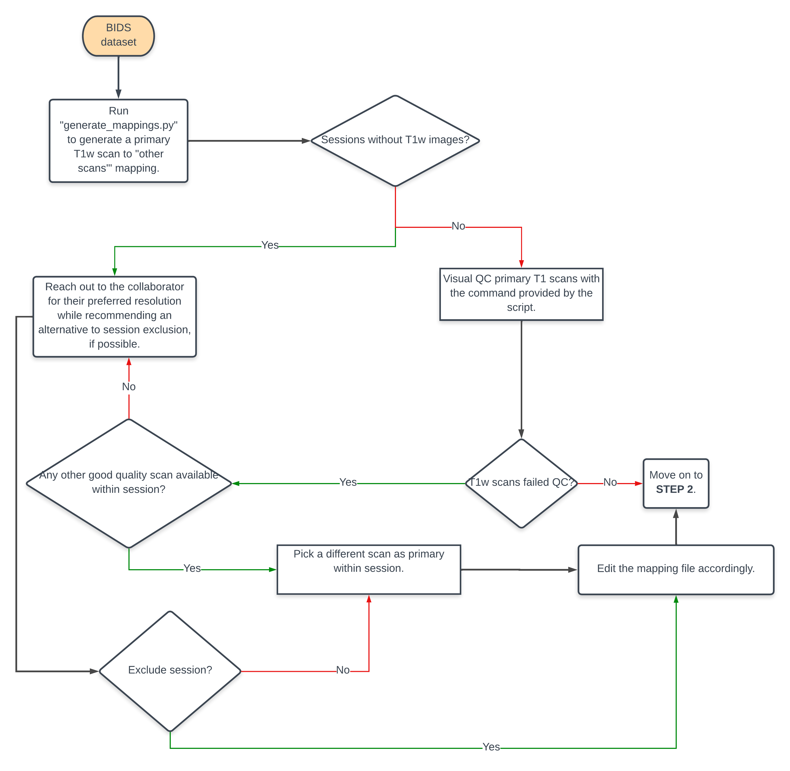

# DSST Defacing Pipeline

The defacing pipeline for datasets curated by the [Data Science and Sharing Team (DSST)](https://cmn.nimh.nih.gov/dsst) are completed in four steps. Each of these steps is explained in more detail with an example in the next section. The pipeline requires a BIDS dataset as input.

1. Generate and finalize ["primary" scans](#glossary) to [other scans'](#glossary) mapping file. 
2. Deface primary scans
   with [@afni_refacer_run](https://afni.nimh.nih.gov/pub/dist/doc/htmldoc/tutorials/refacer/refacer_run.html) program
   developed by the AFNI Team. To deface remaining scans in the session, register them to the primary scan and use
   it's defacemask to generate a defaced image.
    **NOTE**: If a session doesn't have a T1w scan, then `@afni_refacer_run` is run on all every scan individually. 
3. Visually inspect defaced scans with your preferred QC tool. 
4. Fix defacings that failed visual inspection.



## Example

### **Step 0:** Get data and code
Clone this repository to a preferred location on your machine.

```bash
git clone git@github.com:nih-fmrif/dsst-defacing-pipeline.git
```

We'll be running the scripts on the [MyConnectome](https://openneuro.org/datasets/ds000031/versions/1.0.0) dataset. The dataset is available for download on OpenNeuro as [ds000031](https://openneuro.org/datasets/ds000031/versions/1.0.0/download). 

```bash
datalad install https://github.com/OpenNeuroDatasets/ds000031.git
```

Download data in `anat` directories of the dataset.

```bash
datalad get sub-01/ses-*/anat
```

BIDS tree snippet post-download:

```bash
$ tree ../datasets/ds000031/
../datasets/ds000031/
├── CHANGES
├── README
├── dataset_description.json
├── events.json
├── participants.json
├── participants.tsv
├── sub-01
│   ├── ses-001
│   │   ├── anat
│   │   │   ├── sub-01_ses-001_T1w.json
│   │   │   └── sub-01_ses-001_T1w.nii.gz 
│   │   ├── sub-01_ses-001_scans.json
│   │   └── sub-01_ses-001_scans.tsv
│   ├── ses-003
│   │   ├── anat
│   │   ├── sub-01_ses-003_scans.json
│   │   └── sub-01_ses-003_scans.tsv
...
└── task-spatialwm_events.json
```


### **Step 1:** Generate mapping file.

a. Generate a mapping file using the `generate_mappings.py` script. 
b. Look at your mapping file. Make sure it's not empty. Edit it, if there are any special cases you'd like to account for.

```
$ python generate_mappings.py -i ../datasets/ds000031 -o ./examples                                                                              
====================
Dataset Summary
====================
Total number of sessions with 'anat' directory in the dataset: 24
Sessions with 'anat' directory with at least one T1w scan: 22
Sessions without a T1w scan: 2
List of sessions without a T1w scan:
 ['sub-01/ses-053', 'sub-01/ses-016']

Please find the mapping file in JSON format and other helpful logs at /Users/arshithab/dsst-defacing-pipeline/examples
```

### **Step 2:** Deface scans
Run `dsst_defacing_wf.py` script that calls on `deface.py` and `register.py` to deface scans in the dataset. 

#### Option 1: Serially
If you have a small dataset with less than 10 subjects, then it might be easiest to run the defacing algorithm serially.

```bash
python dsst_defacing_wf.py -i ../datasets/ds000031 -m examples/primary_to_others_mapping.json -o examples
```

#### Option 2: Parallelly
If you have dataset with over 10 subjects, then it might be more practical to run it in parallel. Here's the command one would use to run it on NIH HPC:

```bash
for i in `ls -d ../datasets/toy/*`; do SUBJ=$(echo $i | sed 's|../datasets/toy/||g' ); echo "python dsst_defacing_wf.py -i ../datasets/ds000031 -m examples/primary_to_others_mapping.json -o examples -s $SUBJ"; done > ./examples/defacing_parallel.swarm
swarm -f ./examples/defacing_parallel.swarm --module afni,fsl --merge-output --logdir ./examples/swarm_log
```

### **Step 3:** Visually QC defaced scans.

Visual QC defacing accuracy gallery https://raamana.github.io/visualqc/gallery_defacing.html

## Glossary

- **Primary Scan:** The best quality T1w scan within a session. For programmatic selection, we assume that the most
  recently acquired T1w scan is of the best quality.
- **Other/Secondary Scans:** All scans *except* the primary scan are grouped together and referred to as "other" or "
  secondary" scans for a given session.
- **[VisualQC](https://raamana.github.io/visualqc):** A suite of QC tools developed by Pradeep Raamana (Assistant
  Professor at University of Pittsburgh).

## References

1. Theyers AE, Zamyadi M, O'Reilly M, Bartha R, Symons S, MacQueen GM, Hassel S, Lerch JP, Anagnostou E, Lam RW, Frey
   BN, Milev R, Müller DJ, Kennedy SH, Scott CJM, Strother SC, and Arnott SR (2021)
   [Multisite Comparison of MRI Defacing Software Across Multiple Cohorts](10.3389/fpsyt.2021.617997). Front. Psychiatry
   12:617997. doi:10.3389/fpsyt.2021.617997
2. `@afni_refacer_run` is the defacing tool used under the hood. [AFNI Refacer program](https://afni.nimh.nih.gov/pub/dist/doc/htmldoc/tutorials/refacer/refacer_run.html).
3. FSL's [FLIRT](https://fsl.fmrib.ox.ac.uk/fsl/fslwiki/FLIRT)
   and [`fslmaths`](https://fsl.fmrib.ox.ac.uk/fsl/fslwiki/Fslutils?highlight=%28fslmaths%29) programs have been used
   for registration and masking steps in the workflow.
4. [VisualQC](https://raamana.github.io/visualqc/) utility.

## Acknowledgements

We'd like to thank [Pradeep Raamana](https://www.aimi.pitt.edu/people/ant), Assistant Professor at the Department of
Radiology at University of Pittsburgh, and [Paul Taylor](https://afni.nimh.nih.gov/Staff), Acting Director of Scientific
and Statistical Computing Core (SSCC) at NIMH for their timely help in resolving and adapting VisualQC and AFNI Refacer,
respectively, for the specific needs of this project.
