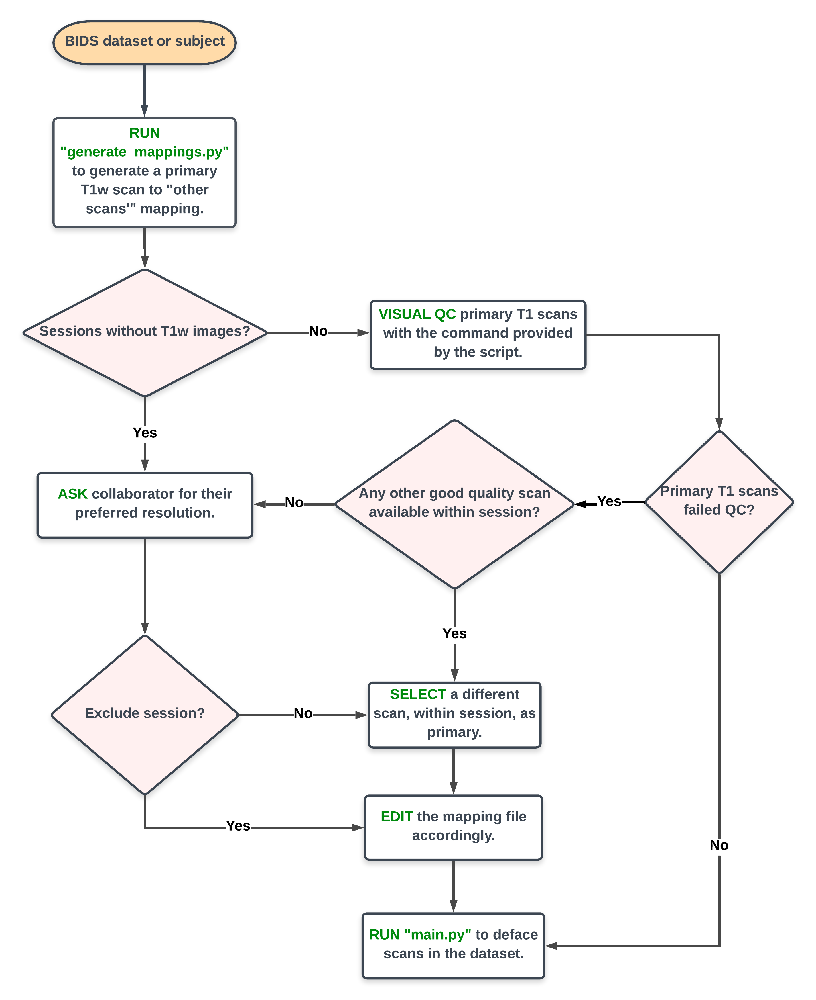

# DSST Defacing Workflow

The defacing workflow for datasets curated by the Data Science and Sharing Team will be completed in three major steps.

1. Determine "primary" scans for each session in the dataset and ensure that they are good quality images.
2. Deface primary scans
   with [@afni_refacer_run](https://afni.nimh.nih.gov/pub/dist/doc/htmldoc/tutorials/refacer/refacer_run.html) program
   developed by the AFNI Team. To deface remaining scans in the session, register them to the primary scan and use
   it's defacemask to generate a defaced image.
3. Visually QC defaced scans. For scans that fail QC, figure out how to fix them and if they can't be fixed, consider
   excluding the scan from the dataset after checking with the collaborator. @TODO: Need a more specific SoP of sorts
   for this step.

**NOTE:** It's assumed throughout this document that the input dataset to defacing algorithm is in BIDS valid format.

## Terminology

- **Primary Scan:** The best quality T1w scan within a session. For programmatic selection, we assume that the most
  recently acquired T1w scan is of the best quality.
- **Other/Secondary Scans:** All scans *except* the primary scan are grouped together and referred to as "other" or "
  secondary" scans for a given session.
- **[VisualQC](https://raamana.github.io/visualqc):** A suite of QC tools developed by Pradeep Ramanna, assistant
  Professor at University of Pittsburgh. While a noun, it's sometimes also used as a verb to refer to "QC-ing scans
  visually". Within the team, a sentence like "We'll be Visual QC-ing primary scans." means that we'll be eyeball-ing
  the primary scans using VisualQC.

## Workflow

### STEP 1: Generate and finalize "primary" scans to "other" scans mapping file.

Generate a mapping file using the `generate_mappings.py` script. Edit the generated mapping file, if necessary. Use the
flowchart below as reference while making decisions about or changes to the mapping file. The time and effort required
to complete this step is dependent on the dataset. For example:

1. Do all sessions within the dataset have a T1w scan associated with them? If there are sessions without a T1w image,
   then the user will have to decide which other scan in the session is of good enough quality to be used as a primary
   scan. This might require some back and forth with the collaborator we're curating the dataset for.
2. What's the general quality of acquired scans? Might depend on the scanner used, age group of participants (children
   might be prone to more head motion in the scanner than adults), QA/QC practices during acquisition, etc.

Of all the other steps in the workflow, this is the most important one. Most scans that were flagged as `failed` while
QC-ing them at the end were found to be because the primary scan wasn't of good quality which messed up registration of
other/secondary scans within the session.

@TODO: How do we define "good quality"?

Here's a flow chart of what this process might look like.



```
usage: generate_mappings.py [-h] [-i INPUT_DIR] [-o SCRIPT_OUTPUT_DIR]

Generates Primary to "others" mapping file and prints VisualQC's T1 MRI utility command.

    Terminology
    -----------

    "primary scan" : Best quality T1w scan, ideally. If T1s not available, we'll need another strategy to pick a primary scan.
    "other scans" : Apart from the primary scan, every "other" scan within the subject-session anat directory is considered a secondary or "other" scan.

    References
    ----------
    visualqc T1 MRI utility : https://raamana.github.io/visualqc/cli_t1_mri.html

optional arguments:
  -h, --help            show this help message and exit
  -i INPUT_DIR, --input INPUT_DIR
                        Path to input BIDS directory.
  -o SCRIPT_OUTPUT_DIR, --output SCRIPT_OUTPUT_DIR
                        Path to directory that'll contain this script's outputs.

```

Example command:

```bash
python generate_mappings.py -i /data/NIMH_scratch/defacing_comparisons/code/code_refactoring/defacing_wf_data/as_toy_data/ -o scripts_outputs
```

### STEP 2: Actually deface scans.

At this point, a big chunk of the job is done. Run `main.py` script that calls on `deface.py` and `register.py` to
deface scans in the dataset.

```bash
usage: main.py [-h] --input INPUT --output OUTPUT --mapping-file MAP [--level {group,participant}] [--participant SUBJID]

Deface anatomical scans for a given BIDS dataset.

optional arguments:
  -h, --help            show this help message and exit
  --input INPUT, -i INPUT
                        Path to input BIDS dataset.
  --output OUTPUT, -o OUTPUT
                        Path to output BIDS dataset with defaced scan.
  --mapping-file MAP, -m MAP
                        Path to primary to other/secondary scans mapping file.
  --level {group,participant}, -l {group,participant}
                        'group': Runs defacing commands, serially, on all subjects in the dataset. 'participant': Runs defacing commands on a single subject and its associated sessions.
  --participant SUBJID, -p SUBJID
                        Subject ID associated with the participant. Since the input dataset is assumed to be BIDS valid, this argument expects subject IDs with 'sub-' prefix.

```

Example:

```bash
```

### STEP 3: Visually QC defaced scans.

**STEP 3 usage notes**

```bash
```

## Project History

Links to documents used to jot down our thoughts/ideas in the process of testing various tools and procedures

- [Slides from early days of the Project](https://docs.google.com/presentation/d/1-eNBUjRG89kgq1sxaphNEqWQ3KZQ0kpeCfGQprqlqWo/edit#slide=id.g116908c6bac_0_0)
- [Meeting notes with Adam and Dustin](https://docs.google.com/presentation/d/18MnazvqRg5nlVoA8SpqID5F0RzFHjfr40btpudNGOUw/edit#slide=id.g138febac7d2_0_25)

## Dealing with edge cases

**@TODO**
Add solutions or tweaks that the user could have in their arsenal when met with edge cases such as

- [ ] subject-sessions with no T1s.
- [ ] anisotropic mri acquisitions are skewed in Visual QC.

## Types of QC-failures we saw

**@TODO**
[ ] Add screenshots with example failures and a fix if available.

## References

**@TODO**

- [ ] Links to afni_refacer_run, fsl flirt, fslmaths and visual qc documents.
- [ ] other links with useful information about defacing example papers etc

https://afni.nimh.nih.gov/afni/community/board/read.php?1,159053,159053#msg-159053

https://fsl.fmrib.ox.ac.uk/fsl/fslwiki/fsl_anat

https://andysbrainbook.readthedocs.io/en/latest/fMRI_Short_Course/Preprocessing/Skull_Stripping.html

## Acknowledgements

**@TODO**
Acknowledge

- [ ] Pradeep Ramanna
- [ ] Paul Taylor and AFNI team
