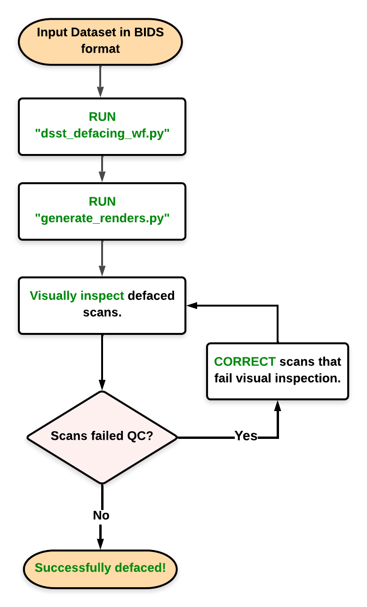

# DSST Defacing Pipeline

The DSST Defacing Pipeline has been developed to make the process of defacing anatomical scans of large datasets,
visually inspecting for accuracy and fixing scans that fail visual inspection more efficient and straightforward. The
pipeline _requires_ the input dataset to be in BIDS format. A conceptual description of the pipeline can
found [here](#conceptual-design).

This pipeline is designed and tested to work on the NIH HPC systems. While it's possible to get the pipeline running on
other platforms, please note that it can be error-prone and is not recommended.

## Usage Instructions

### Clone this repository

```bash
git clone git@github.com:nih-fmrif/dsst-defacing-pipeline.git
```

### Install required packages

Apart from AFNI and FSL packages, available as HPC modules, users will need the following packages in their working
environment

- VisualQC
- FSLeyes
- Python 3.x

There are many ways to create a virtual environment with the required packages, however, we currently only provide
instructions to create a conda environment. If you don't already have conda installed, please find
instructions [here](https://docs.conda.io/en/latest/miniconda.html). Run the following command to create a conda
environment called `dsstdeface` using the `environment.yml` file from this repo.

```bash
conda env create -f environment.yml
```

Once conda finishes creating the virtual environment, activate `dsstdeface`.

 ```bash
 conda activate dsstdeface
 ```

### Run `dsst_defacing_wf.py`

To deface anatomical scans in the dataset, run `dsst_defacing_wf.py` script.

```
% python src/dsst_defacing_wf.py -h                                                                                            
usage: dsst_defacing_wf.py [-h] --input INPUT --output OUTPUT [--participant-id SUBJ_ID] [--session-id SESS_ID] [--no-clean]

Deface anatomical scans for a given BIDS dataset or a subject directory in BIDS format.

optional arguments:
  -h, --help            show this help message and exit
  --input INPUT, -i INPUT
                        Path to input BIDS dataset.
  --output OUTPUT, -o OUTPUT
                        Path to output BIDS dataset with defaced scan.
  --participant-id SUBJ_ID, -p SUBJ_ID
                        Subject ID associated with the participant. Since the input dataset is assumed to be BIDS valid, this argument expects subject IDs with 'sub-' prefix.
  --session-id SESS_ID, -s SESS_ID
                        Session ID associated with the subject ID. If the BIDS input dataset contains sessions, then this argument expects session IDs with 'ses-' prefix.
  --no-clean            If this argument is provided, then AFNI intermediate files are preserved.

```

The script can be run serially on a BIDS dataset or in parallel at subject/session level. The three methods of running
the script have been described below with example commands:

For readability of example commands, the following bash variables have defined as follows:

```bash
INPUT_DIR="<path/to/BIDS/input/dataset>"
OUTPUT_DIR="<path/to/desired/defacing/output/directory>"
```

**NOTE:** In the example commands below, `<path/to/BIDS/input/dataset>` and `<path/to/desired/output/directory>` are
placeholders for paths to input and output directories, respectively.

#### Option 1: Serially

If you have a small dataset with less than 10 subjects, then it might be easiest to run the defacing algorithm serially.

```bash
python dsst-defacing-pipeline/src/dsst_defacing_wf.py -i ${INPUT_DIR} -o ${OUTPUT_DIR}
```

#### Option 2: In parallel at subject level

If you have dataset with over 10 subjects, then it might be more practical to run the pipeline in parallel for every
subject in the dataset using the `-p/--participant-id` option as follows:

```bash
python dsst_defacing_wf.py -i ${INPUT_DIR} -o ${OUTPUT_DIR} -p sub-<index>
```

a. Assuming these scripts are run on the NIH HPC system, the first step would be to create a `swarm` file:

  ```bash
  
  for i in `ls -d ${INPUT_DIR}/sub-*`; do \
    SUBJ=$(echo $i | sed "s|${INPUT_DIR}/||g" ); \
    echo "python dsst-defacing-pipeline/src/dsst_defacing_wf.py -i ${INPUT_DIR} -o ${OUTPUT_DIR} -p ${SUBJ}"; \
    done > defacing_parallel_subject_level.swarm
  ```

Purpose: Loop through the dataset and find all subject directories to construct `dsst_defacing_wf.py` command
with `-p/--participant-id` option.

b. Run the swarm file with following command to start a swarm job

  ```bash
  swarm -f defacing_parallel_subject_level.swarm --merge-output --logdir ${OUTPUT_DIR}/swarm_log
  ```

#### Option 3: In parallel at session level

If the input dataset has multiple sessions per subject, then run the pipeline on every session in the dataset
parallelly. Similar to Option 2, the following commands loop through the dataset to find subject and session IDs to
create a `swarm` file to be run on NIH HPC systems.

```bash
for i in `ls -d ${INPUT_DIR}/sub-*`; do
  SUBJ=$(echo $i | sed "s|${INPUT_DIR}/||g" );
  for j in `ls -d ${INPUT_DIR}/${SUBJ}/ses-*`; do
    SESS=$(echo $j | sed "s|${INPUT_DIR}/${SUBJ}/||g" )
    echo "python dsst-defacing-pipeline/src/dsst_defacing_wf.py -i ${INPUT_DIR} -o ${OUTPUT_DIR} -p ${SUBJ} -s ${SESS}";
    done;
  done > defacing_parallel_session_level.swarm
```

```bash
swarm -f defacing_parallel_session_level.swarm --merge-output --logdir ${OUTPUT_DIR}/swarm_log
```

### Run `generate_renders.py`

Generate 3D renders for every defaced image in the output directory.

  ```bash
  python dsst-defacing-pipeline/src/generate_renders.py -o ${OUTPUT_DIR}
  ```

### Visual Inspection

To visually inspect quality of defacing with [VisualQC](https://raamana.github.io/visualqc/readme.html), we'll need to:

1. Open TurboVNC through an spersist session. More info [here](https://hpc.nih.gov/docs/nimh.html).
2. Run the `vqcdeface` command from a command-line terminal within a TurboVNC instance

  ```bash
  sh ${OUTPUT_DIR}/QC_prep/defacing_qc_cmd
  ```

## Conceptual design

1. Generate a ["primary" scans](#terminology) to [other scans'](#terminology) mapping file.
2. Deface primary scans
   with [@afni_refacer_run](https://afni.nimh.nih.gov/pub/dist/doc/htmldoc/tutorials/refacer/refacer_run.html) program
   developed by the AFNI Team.
3. To deface remaining scans in the session, register them to the primary scan (using FSL `flirt` command) and then use
   the primary scan's defacemask to generate a defaced image (using `fslmaths` command).
4. Visually inspect defaced scans with [VisualQC](https://raamana.github.io/visualqc) deface tool or any other preferred
   tool.
5. Correct/fix defaced scans that failed visual inspection. See [here]() for more info on types of failures.



## Terminology

While describing the process, we frequently use the following terms:

- **Primary Scan:** The best quality T1w scan within a session. For programmatic selection, we assume that the most
  recently acquired T1w scan is of the best quality.
- **Other/Secondary Scans:** All scans *except* the primary scan are grouped together and referred to as "other" or "
  secondary" scans for a given session.
- **Mapping File:** A JSON file that assigns maps a primary scan (or `primary_t1`) to all other scans within a session.
  Please find an example file [here]().
- **[VisualQC](https://raamana.github.io/visualqc):** A suite of QC tools developed by Pradeep Raamana (Assistant
  Professor at University of Pittsburgh).

## References

1. Theyers AE, Zamyadi M, O'Reilly M, Bartha R, Symons S, MacQueen GM, Hassel S, Lerch JP, Anagnostou E, Lam RW, Frey
   BN, Milev R, Müller DJ, Kennedy SH, Scott CJM, Strother SC, and Arnott SR (2021)
   [Multisite Comparison of MRI Defacing Software Across Multiple Cohorts](10.3389/fpsyt.2021.617997). Front. Psychiatry
   12:617997. doi:10.3389/fpsyt.2021.617997
2. `@afni_refacer_run` is the defacing tool used under the
   hood. [AFNI Refacer program](https://afni.nimh.nih.gov/pub/dist/doc/htmldoc/tutorials/refacer/refacer_run.html).
3. FSL's [FLIRT](https://fsl.fmrib.ox.ac.uk/fsl/fslwiki/FLIRT)
   and [`fslmaths`](https://fsl.fmrib.ox.ac.uk/fsl/fslwiki/Fslutils?highlight=%28fslmaths%29) programs have been used
   for registration and masking steps in the workflow.
4. [VisualQC](https://raamana.github.io/visualqc/) utility.

## Acknowledgements

We'd like to thank [Pradeep Raamana](https://www.aimi.pitt.edu/people/ant), Assistant Professor at the Department of
Radiology at University of Pittsburgh, and [Paul Taylor](https://afni.nimh.nih.gov/Staff), Acting Director of Scientific
and Statistical Computing Core (SSCC) at NIMH for their timely help in resolving and adapting VisualQC and AFNI Refacer,
respectively, for the specific needs of this project.
